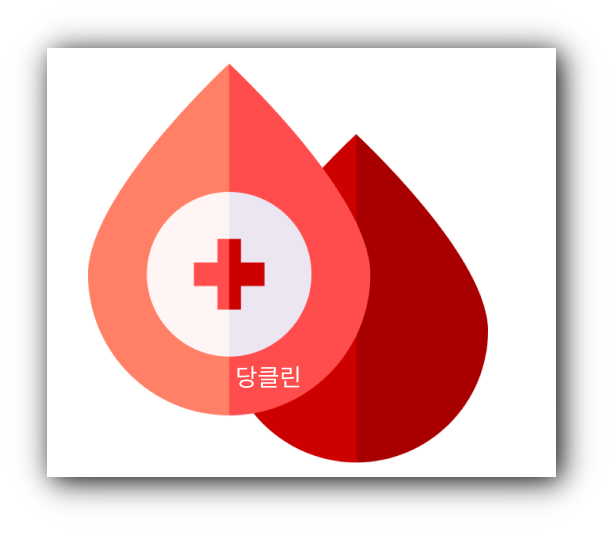

# 당클린

  

## Intro.

1인 개발(풀스택)로 진행한 프로젝트입니다.

 

## 프로젝트 소개

혈당 관리는 당뇨인들에게 정말 중요합니다. 최근 단 음식으로 인해 젊은 세대에서도 당뇨 환자들이 증가하고 있습니다.

이프로젝트를 진행하게 된 이유는 혈당 관리를 소홀히 하는 당뇨인들이 자신의 당관리를 철저히 
하고 다른사람들과 소통하면서 건강을 챙겨보자는 취지로 만들게 되었습니다. 

## 사용 기술

### **Client**

- **TypeScript**
- **React, React-router v6**
- **zustand(클라이언트 상태 관리)**
- **React-query (서버 상태 관리**
- **emotion**
- **React-form-hook,Day.js, React-chartjs-2**

### **Server**

- **expressjs**
- **mongoDB, mongoose**
- **Json Web Token**
- **Bcrypt**